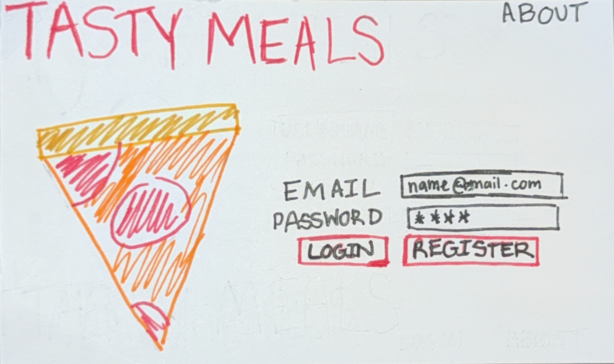
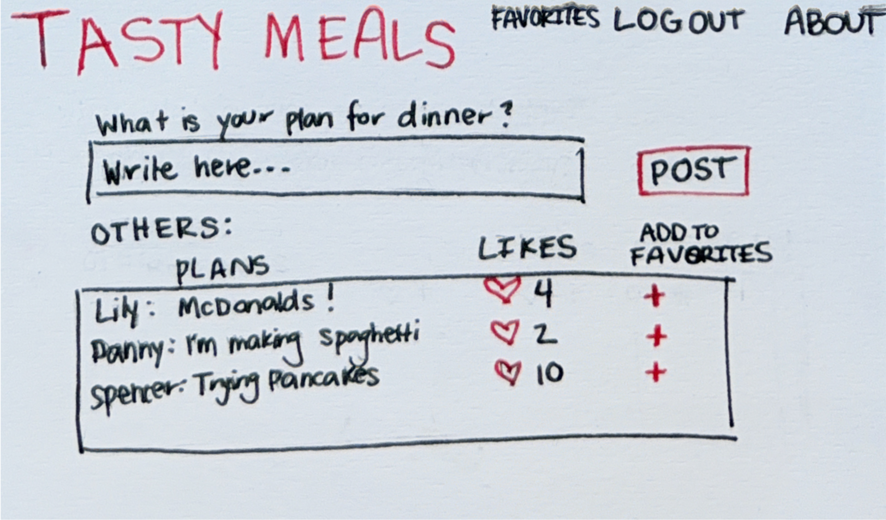
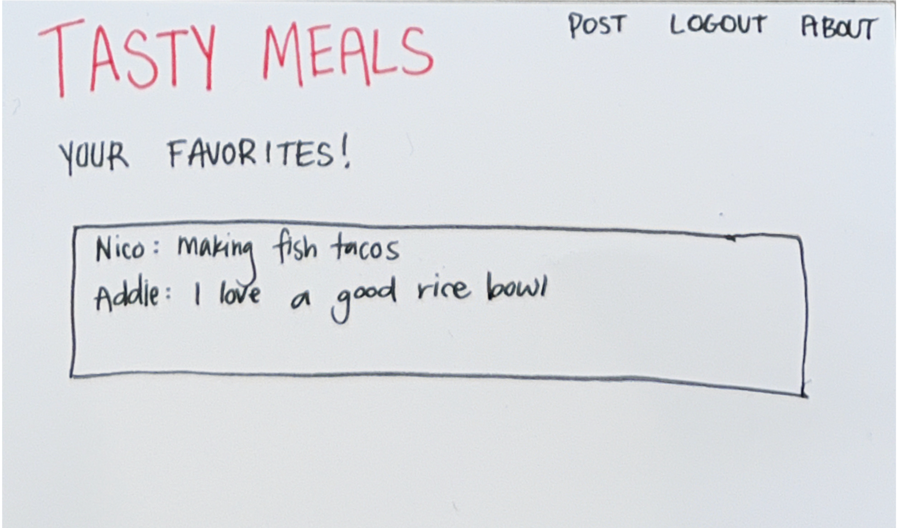
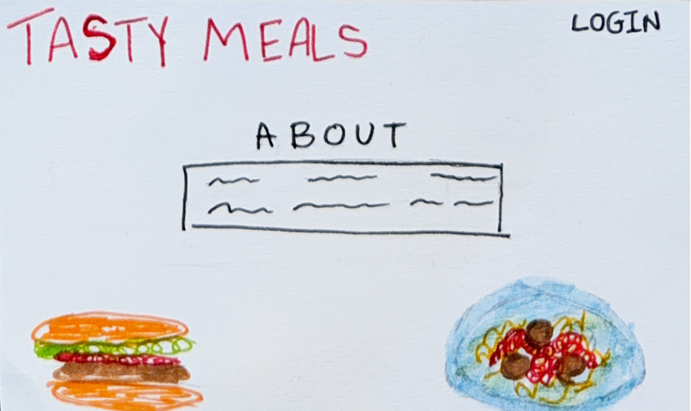
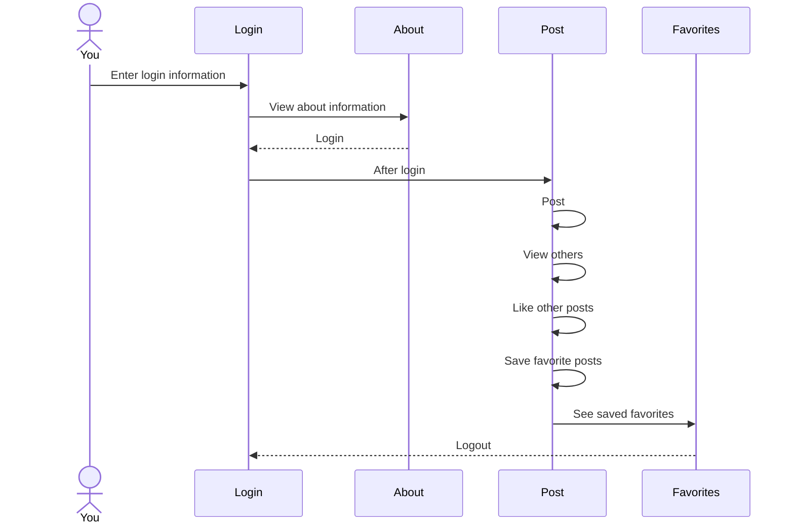

# Tasty Meals

[My Notes](notes.md)

Tasty Meals helps you meal plan for dinner and shows you other people's plans for future inspiration.

## 🚀 Specification Deliverable

For this deliverable I did the following. I checked the box `[x]` and added a description for things I completed.

- [x] Proper use of Markdown
- [x] A concise and compelling elevator pitch
- [x] Description of key features
- [x] Description of how you will use each technology
- [x] One or more rough sketches of your application. Images must be embedded in this file using Markdown image references.

### Elevator pitch

Are you sick of making the same meals all the time for dinner? Have you ever wondered what your friends or others are making? With Tasty Meals, not only will you be more organized in your meal planning but also you will be more inspired in your dinner choices. Use Tasty Meals to post about your meals and see what those around you are making for their tasty dinners!

### Design

 
 

There are four different views including login, posting, saved favorites, and about information. The user is able to post what they plan to have for dinner and see, like, and save other people's plans on the posting view. The saved favorites view shows the posts that the user saved previously. 

### Key features

- Login, logout, and register
- See desciption of the app
- Post plans for dinner
- See the dinner plans posted by other people
- Like other people's posts
- Save favorite posts
- See saved favorite posts
- See total likes for each post

### Technologies

I am going to use the required technologies in the following ways.

- **HTML** - Four HTML pages, a login/register page (login controls), a page that includes a section to write and post dinner plans, a page for saved favorites, and an about page. Images on login and about pages. Correct HTML structure used.
- **CSS** - clean but inviting color scheme, animation of hearts and pluses (when liking or saving a post), styling that looks good on different screens
- **React** - routing to different pages like after login or pressing on the favorites, about, or posting icon, login, display other peoples meal plans, post user's meal plan, displays likes on other people's posts
- **Service** - Endpoints for login/logout/register, recieving and storing dinner plans, third party call to get random pictures of pizza, pasta dish, and burger [Public API Link](https://github.com/surhud004/Foodish#readme)
- **DB/Login** - Store users (and their authentication), dinner plan posts, likes, and favorite posts in database
- **WebSocket** - When the user posts their dinner plan, it is broadcast to all other users

## 🚀 AWS deliverable

For this deliverable I did the following. I checked the box `[x]` and added a description for things I completed.

- [x] **Server deployed and accessible with custom domain name** - [My server link](https://tastymeals.click).

## 🚀 HTML deliverable

For this deliverable I did the following. I checked the box `[x]` and added a description for things I completed.

- [x] **HTML pages** - Four HTML pages for login, posting dinner plans, saved favorite plans, and about information
- [x] **Proper HTML element usage** - used a variety of tags including body, nav, main, header, footer, span, div, and button
- [x] **Links** - The login page automatically links to the posting page and it also includes a link to the about page. The posting page has a link to itself when someone posts and it includes links for the other pages. The favorites page includes links for the other pages. The about page includes a link for the login page.
- [x] **Text** - The about page has text
- [x] **3rd party API placeholder** - The about page includes photos that standin for where the random photos from the API will be
- [x] **Images** - The login page includes an image of a pizza and the about page also has two photos that are standins for the 3rd party API.
- [x] **Login placeholder** - On the login page there is an input box for an email and password and a submit button for login. The username is also displayed on the posting page.
- [x] **DB data placeholder** - favorite posts that are saved and pulled from the database are represented on the favorites page.
- [x] **WebSocket placeholder** - the posting page has a section that represents realtime posts of others people's dinner plans

## 🚀 CSS deliverable

For this deliverable I did the following. I checked the box `[x]` and added a description for things I completed.

- [x] **Visually appealing colors and layout. No overflowing elements.** - elements are included that make the application visually appealing like the use of borders and colors. There are no overflowing elements and that was made possible because of the use of flex-wrap for flex elements. Ellipses are also used for certian text elements. 
- [x] **Use of a CSS framework** - used Bootstrap to help with styling. All buttons and tables are stylized using Bootstrap and so is the navigation menu. 
- [x] **All visual elements styled using CSS** - All visual elements are styled using CSS or Bootstrap. This includes animation of the title, buttons, borders, and more.
- [x] **Responsive to window resizing using flexbox and/or grid display** - Used flexbox for all elements in the application to make it responsive to window resizing.
- [x] **Use of a imported font** - Used Playpen Sans as my imported font
- [x] **Use of different types of selectors including element, class, ID, and pseudo selectors** - Used element, class, ID, psuedo (when adding a hover element to photos), and some other selectors to apply my CSS

## 🚀 React part 1: Routing deliverable

For this deliverable I did the following. I checked the box `[x]` and added a description for things I completed.

- [x] **Bundled using Vite** - installed Vite which bundles code quickly and helped create a React-enabled web application
- [x] **Components** - I have the app component and then four view components including login, post, favorites, and about. 
- [x] **Router** - routing between the login, post, favorites, and about components

## 🚀 React part 2: Reactivity deliverable

For this deliverable I did the following. I checked the box `[x]` and added a description for things I completed.

- [x] **All functionality implemented or mocked out** - user username and password, others posts, favorite posts, and their respective likes all saved in local storage. Websocket was represented using a timer to "post" other people's plans. Login and logout were implemented. Images on the about page are changed when page is refreshed to represent a call to a 3rd party.
- [x] **Hooks** - useState and useEffect are used in most jsx files

## 🚀 Service deliverable

For this deliverable I did the following. I checked the box `[x]` and added a description for things I completed.

- [x] **Node.js/Express HTTP service** - Installed Express. Default port on 4000.
- [x] **Static middleware for frontend** - middleware endpoints in service/index
- [x] **Calls to third party endpoints** - About page calls to an API that returns random food images [Public API Link](https://github.com/surhud004/Foodish#readme) 
- [x] **Backend service endpoints** - endpoints in service/index for auth, posts, and favorites
- [x] **Frontend calls service endpoints** - mocked functionality in frontend compenentants replaced with calls to the service
- [x] **Supports registration, login, logout, and restricted endpoint** - supports for registration, login, logout and restricted access to posts, posting, and favorites (using verifyAuth)

## 🚀 DB deliverable

For this deliverable I did the following. I checked the box `[x]` and added a description for things I completed.

- [x] **Stores data in MongoDB** - posts (including indvidual favorites) stored in MongoDB from "service/database.js"
- [x] **Stores credentials in MongoDB** - auth for users stored in MongoDB from "service/database.js"

## 🚀 WebSocket deliverable

For this deliverable I did the following. I checked the box `[x]` and added a description for things I completed.

- [x] **Backend listens for WebSocket connection** - Backend listens for connection in peerProxy.js
- [x] **Frontend makes WebSocket connection** - Frontend makes connection in postNotifier.js
- [x] **Data sent over WebSocket connection** - JSON representation of posts sent over connection with broadcastEvent function found in postNotifier.js
- [x] **WebSocket data displayed** - posts are displayed on post page and are updated in realtime
- [x] **Application is fully functional** - application works the way I hoped it to!
